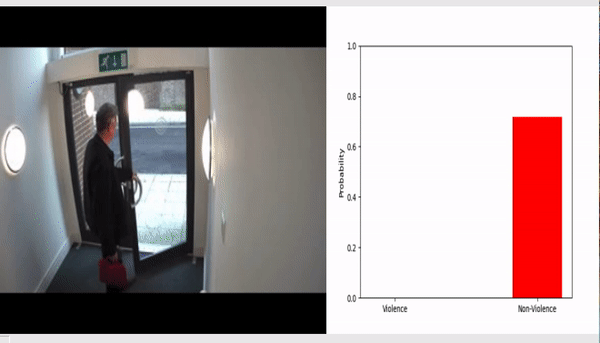

# ViolenceDetectionInVideos

The goal of the project is to detect violence in videos. The dataset used is RWF-2000. The state-of-the-art accuracy of the Flow Gated Network model [(refer)](https://arxiv.org/abs/1911.05913) using 3D CNN is 87%. In this project, I have tried 2 architecture implementations to solve this problem. First is my own implementation of the Flow Gated Network model using 2D pre-trained CNN models in Pytorch. It achieves an accuracy of 73.5% on the test set. In the second implementation, I customised the architecture involving ConvLSTM [(refer)](https://github.com/swathikirans/violence-recognition-pytorch) to achieve an accuracy of about 80% on the test set. 

Here are some of the results on the test set on videos:

---

---

---
